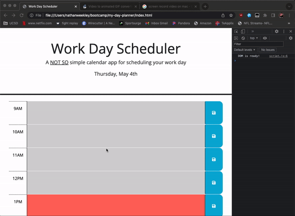

# Nate's Javascript Quiz v1.0
> Use starter code to complete a work day scheduler
> Must display current day at top of calendar
> Must use timeblocks for standard business hours
> Must color code timeblocks past/present/future
> Must be able to enter events
> Save buttons must store to local storage
> Must display saved local storage strings upon refresh
> Live demo [_here_](https://nweekley84.github.io/my-day-planner/).

## Table of Contents
* [General Info](#general-information)
* [Technologies Used](#technologies-used)
* [Features](#features)
* [Screenshots](#screenshots)
* [Setup](#setup)
* [Usage](#usage)
* [Project Status](#project-status)
* [Room for Improvement](#room-for-improvement)
* [Acknowledgements](#acknowledgements)
* [Contact](#contact)
* [License](#license)

## General Information
- Create a simple calendar application that allows a user to save events for each hour of the day by modifying starter code.
- Purpose is to put into practice local storage and more importantly play around with Day.js.
- Undertaken because it utilizes what we learned in module 5, and lets us explore Day.js indepth.

## Technologies Used
- VSCode 1.76.2
- Chrome Dev Tools 112.0.5615.121 
- macOS Mojave 10.14.6 

## Features
- Upon page load, display the current Date in the header.
- Use plugin script for Advanced Formatting in Day.js to display 1st, 2nd, 3rd, ect..
- Wrap everything in a document.ready function so DOM loads first.
- Displays 8 time-blocks for standard work day 9am-5pm.
- Dynamically display each block with color codes to reflect past/present/future using css/js.
- Dynamically update in realtime without refreshing as hours pass.
- Store events added to each timeblock in local storage.
- Make sure stored event's persist upon refresh and display in their corresponding time-blocks.

## Screenshots

## Setup
N/A

## Usage
To organize your daily events for work.

## Project Status
Project is: / _complete_ /

## Room for Improvement
Room for improvement:
- None?

To do:
- Nothing.

## Acknowledgements
- This project was inspired by starter code provided via UCSD Full Stack Coding Bootcamp.
- Many thanks always to MDN Web Docs, Stackoverflow, Google, YouTube and ChatGPT.

## Contact
Created by [Nathan Weekley](mailto:nweekley84@gmail.com) - feel free to contact me!

## License
This project is [MIT](https://opensource.org/licenses/MIT) licensed.